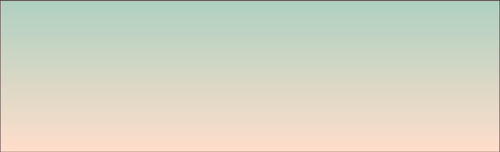
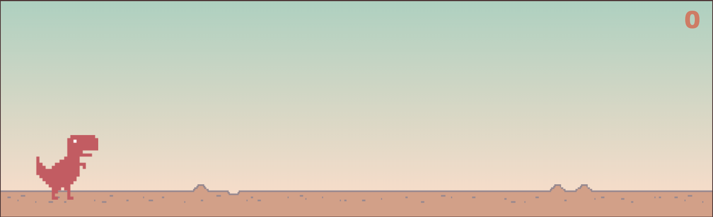
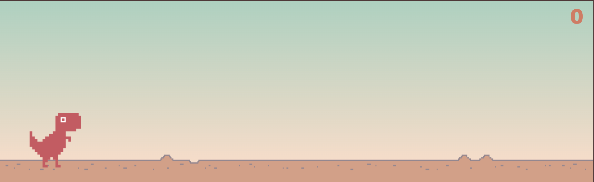
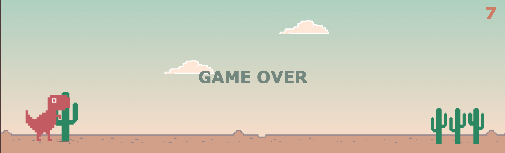

# Dino Game

Hoje vamos implementar o jogo do [Dinossauro](https://dino-chrome.com/en) que aparece quando ficas sem internet no Chrome.

Na pasta `img` já se encontram todos os elementos necessários para os gráficos do jogo:
* `cactus1.png`, apenas um cacto para saltar.
* `cactus2.png`, vários cactos para saltar.
* `cloud.png`, nuvens para decorar o background.
* `dino.png`, diferentes estados do dinossauro.
* `ground.png`, o chão que vai ser pisado pelo dinossauro.

Na pasta `css` está o ficheiro `style.css` que permite alterar o estilo de alguns componentes do jogo.

Na pasta `js` vais encontrar a lógica do jogo, que é essencialmente onde vais trabalhar hoje.

Vamos então começar a programar! Na raiz do teu projecto, cria um ficheiro chamado `index.html` com o seguinte conteúdo:

```
<!DOCTYPE html>
<html lang="en">

<head>
    <meta charset="UTF-8">
    <meta http-equiv="X-UA-Compatible" content="IE=edge">
    <meta name="viewport" content="width=device-width, initial-scale=1.0">
    <title>Dino Game</title>
    <link rel="stylesheet" href="css/style.css">
</head>

<body>
    <div class="frame">
        <div class="ground"></div>
        <div class="dino"></div>
        <div class="points">0</div>
    </div>
    <script src="js/game.js"></script>
</body>
</html>
```
Agora abre o ficheiro `index.html` com o browser.

Dentro do `body` do teu ficheiro, vais encontrar uma `div` com a class `frame` que é responsável por criar o background do jogo. Se comentares (`<!-- * -->`) as divs com classes `ground`, `dino` e `points`, vais ver o seguinte background:  



Se descomentares as divs que comentaste anteriormente, vais ver também o chão, o dinossauro e o placar de pontos.



Cada `div` representa um elemento do jogo. A `div` com `class=dino` representa o dinossauro. O dinossauro pode estar em dois estados ao longo do jogo: a correr (`running`) ou morto (`dead`). As animações para os diferentes estados foram definidas em CSS e têm os seguintes nomes: `dino-running`, animação visualizada durante o jogo, e `dino-dead`, animação visualizada quando o dino bate num cacto (`game over`).

Vamos agora experimentar as animações. Na `<div class="dino">` adiciona a classe `dino-running` à classe `dino`, ou seja, `<div class="dino dino-running">`. 


Agora remove a classe `dino-running` e adiciona `dino-dead`. 



Já vimos as animações a funcionar! **Por defeito, vamos deixar o dinossauro a correr.**

Agora, vamos adicionar a lógica ao jogo que deve ser implementada no ficheiro `js/logic.js`. Por baixo de `<script src="js/game.js"></script>` adiciona `<script src="js/logic.js"></script>` para incluir o ficheiro JavaScript onde vais desenvolver a lógica do teu jogo.

Vamos começar pela funcionalidade de salto (`jump`). Para isso, abre o ficherio `js/logic.js` e implementa as funções `jump()`, `moveDinoUp()` e `touchGround()`. Para tal, lê os comentários nas variáveis no topo do ficheiro e das funções mencionadas.

Para ver o solo a deslocar para a esquerda ao mesmo tempo que o dinossauro corre, temos de implementar as funções `moveGround()` e `calculateDisplacement()`.

Ok, já parece mais real. E que tal adicionar umas nuvens? Implementa a função `createClouds()` para adicionar nuvens ao cenário. Depois de finalizares esta função, deves ver algo assim:


Agora vamos adicionar os obstáculos, ou seja, os cactos. Para isso implementa a função `createObstacles()`. Dentro da função `moveObstacles()`, existe uma chamada à função `scorePoints()`. Completa a declaração da função com a lógica descrita nos comentários.


Ja vês os obstáculos e os pontos a somar? Agora falta detectar os obstáculos e passar ao estado de fim. No `index.html` adiciona a seguinte linha depois do fim da div `frame`: `<div class="game-over">GAME OVER</div>`. Agora implementa as funções `isCollision(...)`, `dead()` e `detectColision()`. Vamos agora experimentar jogar um bocadinho. Viste o game over a aparecer? Boa, o teu jogo funciona! 



**Stretch Goal:** Vamos agora melhorar um pouco a animação do teu background com a ajuda de algumas variáveis do teu jogo. Na função `scorePoints()` adicionar extra lógica que faz o seguinte:
1. Se o `score` for igual a 5, então queremos alterar a velocidade do jogo para 1 e adicionar a classe de CSS `noon` à div `frame`.
2. Se o `score` for igual a 10, então queremos alterar a velocidade do jogo para 1.25 e adicionar a classe de CSS `afternoon` à div `frame`.
3. Se o `score` for igual a 20, então queremos alterar a velocidade do jogo para 1.75 e adicionar a classe de CSS `night` à div `frame`.

Como se adiciona uma classe de CSS a uma div? `div_name.classList.add("class_name");`

